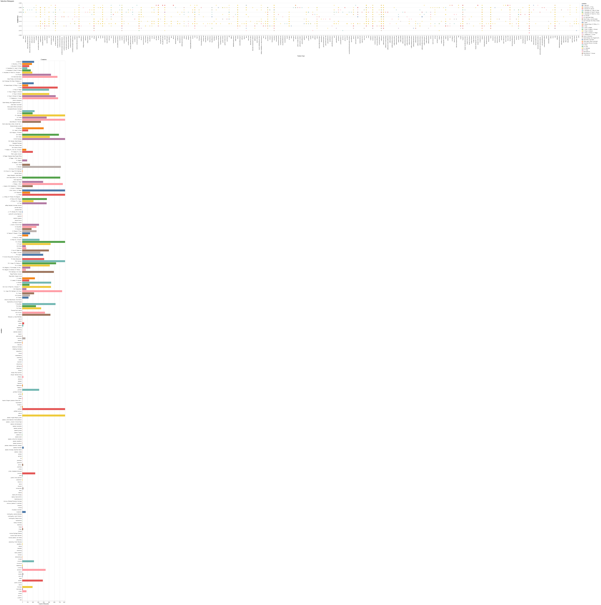
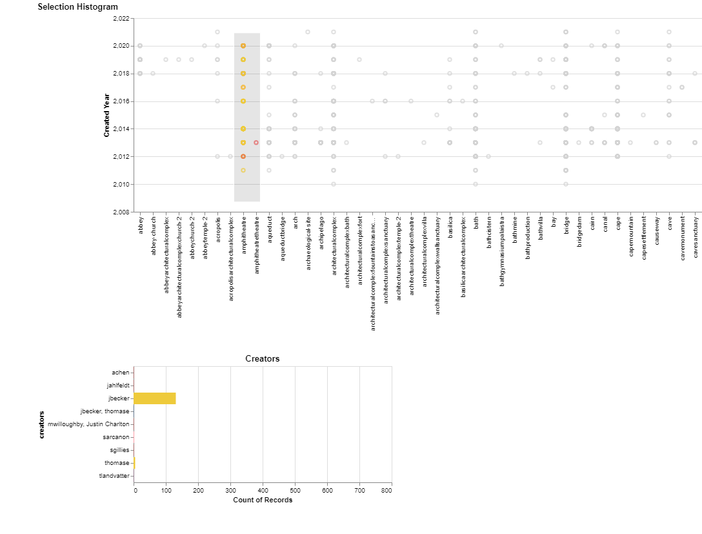
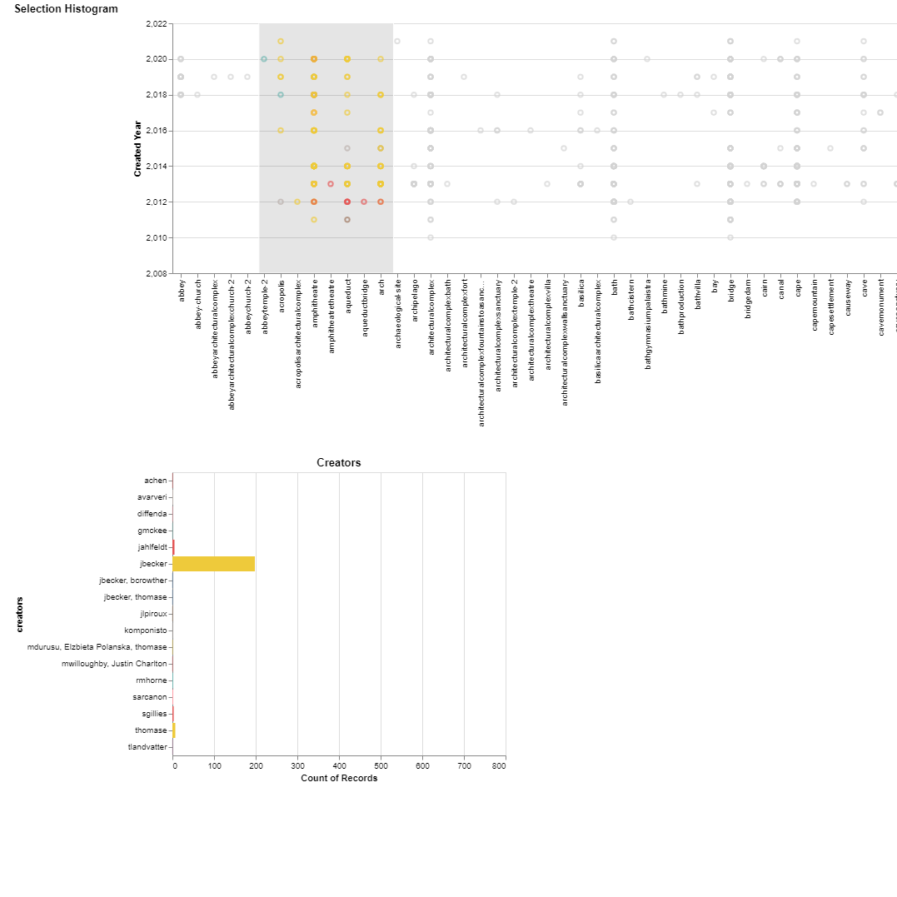

---
elm:
  dependencies:
    gicentre/elm-vegalite: latest

narrative-schemas:
  - archaeology
---

## Author: Yogapriya Vankadari 

# Ancient civilizations
  Pleiades is a community-built gazetteer and graph of ancient places. It publishes authoritative information about ancient places and spaces. This data is used currently to depict visualizations.

  In order to work with Pleides dataset, certain libraries must be imported and then the data must be read from the csv file.

  Importing Libraries:
  ```python
  import pandas as pd
  import altair as alt
  from vega_datasets import data
  ```

  Reading the file:
  ```python
  locations = pd.read_csv("pleiades_loc.csv")
  ```

  
  The data cleaning such as removal of unwanted tuples and noisy data and data formatting required to produce visual design is done after reading the contents from the csv file.

  
  Also, Altair limits the length of data to 5000 rows which might not help in producing an efficient and useful visulization. This limit is removed by using
  ```python
  alt.data_transformers.disable_max_rows()
  ```

## Getting started
## Data Visualization technique : Selection Histogram
This technique links a scatter plot and a histogram together such that a selection in the scatter will plot the selected values in the histogram.

{(aim|}
The aim of this visualization is to identify the `creators` and the `count of contibutions` for a given feature type by each creator.
The Scatterplot in the visualization gives the distribution of feature type against its year of creation.
The histogram below is plotted for creators and represents the count of contributions done by each creator.
Upon selecting the data points for a given feature, count of contributions by each creator for the selected featuretype is reflected in the histogram.
{|aim)}

```python
brush = alt.selection(type='interval')
points = alt.Chart(df_locations_mod_temp).mark_point().encode(
    x=alt.X('featureType:N',
            title='Feature Type'),
    y=alt.Y('created_year:Q',
            scale=alt.Scale(
            domain=(2008, 2022),
            clamp=True,
        ),
            title='Created Year'
           ),
    color=alt.condition(brush, 'creators:N', alt.value('lightgray'))
).add_selection(
    brush
)

bars = alt.Chart(df_locations_mod_temp).mark_bar().encode(
    y='creators:N',
    color='creators:N',
     x=alt.X('count(creators):Q',
            scale=alt.Scale(
            domain=(0, 800),
            clamp=True
        ),
           )
).transform_filter(
    brush
).properties(
    title='Creators'
)
plot = points & bars
plot.properties(title='Selection Histogram')
```
# Output:
The resulting visualization is as shown below:
(Due to the large data set, the resultant image has to be zoomed to be seen clearly)


# Interaction:

**Example 1:**
The data points corresponding to amphitheatre are selected which results in histogram displaying jbecker as the major contributor for featureType:Amphitheatre. Also, the contributions of other creators for amphitheatre are displayed in the histogram.




**Example 2:**
The data points corresponding to acropolis,amphitheatre,archtectural complex,aqueduct and arch are selected which results in histogram displaying jbecker as the major contributor for these featureTypes. Also, the contributions of other creators for amphitheatre are displayed in the histogram.



{(vistype|}
**Selection Histogram**: Scatterplot + Histogram
{|vistype)}

{(vismapping|}
**Scatter plot :**
y = created_year
x = featureType
domainY = domain=(2008, 2022)
selection type = interval
color = creators
**Histogram :**
y = creators
x = count of contribution by creators
color = creators
domainX = (0, 800)
{|vismapping)}

{(dataprep|}
1.remove `'` from feature type
**locations['featureType'] = locations['featureType'].str.replace(",","")**
2.Drop rows with null values in `featureType` and `created` columns
**locations.dropna(axis=0,subset=['featureType'],inplace = True)**
3.Extract year from `created` column
**locations['created_year']=df_locations_mod_temp['created'].astype(str).str[:4]**
{|dataprep)}

{(limitations|}
Due to the large dataset, the interaction with the visualization is slow.
{|limitations)}
