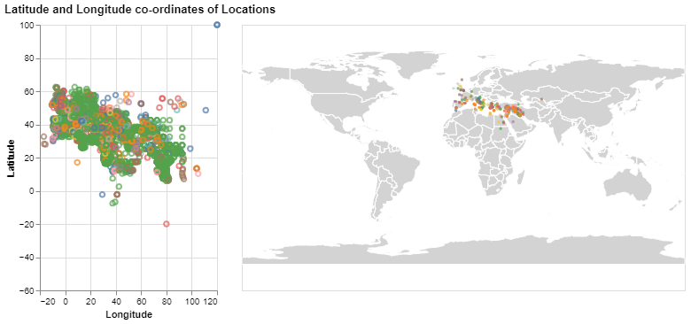

## Data Visualization Technique: Maps
A Choropleth Map is a map composed of colored polygons. It is used to represent spatial variations of a quantity. 
It consists of two sections overlapped on each other
1. Base Map
2. Pointers representing data
{(aim|}
The aim of this visualization is to represent the settlements on the world map distinguished by colors based on settlement types.
The scatterplot displays the settlement types based on latitude and longitude co-ordinates.
The settlements are displayed in various colors based on feature type of settlements - both in Map and scatterplot.
The baseMap is the equirectangular world Map on which the settlements are plotted.
The interaction is the selection of points on the scatterplot that displays the location of the selected settlements on the worldmap.
{|aim)}
**Altair representation of Map:**
```python
countries = alt.topo_feature(data.world_110m.url, 'countries')
selection = alt.selection_interval()

background = alt.Chart(countries).mark_geoshape(
    fill='lightgray',
    stroke='white'
).project(
    "equirectangular"
).properties(
    width=500,
    height=300
)
```
**Scatter plot representation of settlements based on latitude and longitude**
```python
scatter = alt.Chart(locations).mark_point().encode(
    alt.X('reprLong:Q',
        scale=alt.Scale(
            domain=(-20, 120),
            clamp=True
        ),
          title='Longitude'
    ),
   alt.Y('reprLat:Q',
        scale=alt.Scale(
            domain=(-50, 100),
            clamp=True
        ),
          title='Latitude'
    ),
    color=alt.condition(selection, 'featureType:N', alt.value('lightgray'),legend=None),
    tooltip='reprLatLong:N',
).add_selection(
    selection
).properties(
    width=200,
    height=300
)
```
**Display of points on the worldmap**
```python
points = alt.Chart(df_locations).mark_circle(
    size=10,
).encode(
    longitude='reprLong:Q',
    latitude='reprLat:Q',
    shape='featureType:N',
    tooltip='featureType:N',
    color=alt.condition(selection, 'featureType:N', alt.value('lightgray'))
)
```
**Display**
```python
plot = scatter | (background + points)
```
**Data Visualization Output**

**Interaction:**
**Example 1:**
Tooltip functionality of scatterplot displaying (Latitude,Longitude)

**Example 2:**
Interaction where selection of settlements in scatterplots results in display of settlements on worldmap

{(vistype|}
Map with scatterplot
{|vistype)}
{(vismapping|}
**Scatterplot**
x: longitude
y: latitude
color: featuretype
selection: interval
width,height : (200,300)
**points**
longitude=Longitude
latitude=Latitude
shape=featureType
color=featureType
**Map**
type : equirectangular
width,height:(500,300)
{|vismapping)}
{(dataprep|}
1.Removing rows with null values for latitude and longitude.
**locations = locations.dropna(subset=['reprLat','reprLong'])**
{|dataprep)}
{(limitations|}
The map does not provide selection of settlements based on featuretype and also zoom in functionality can be provided for better visualization
{|limitations)}
