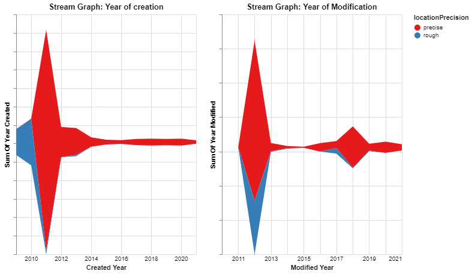
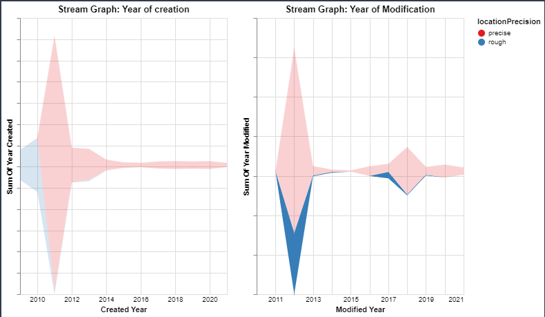
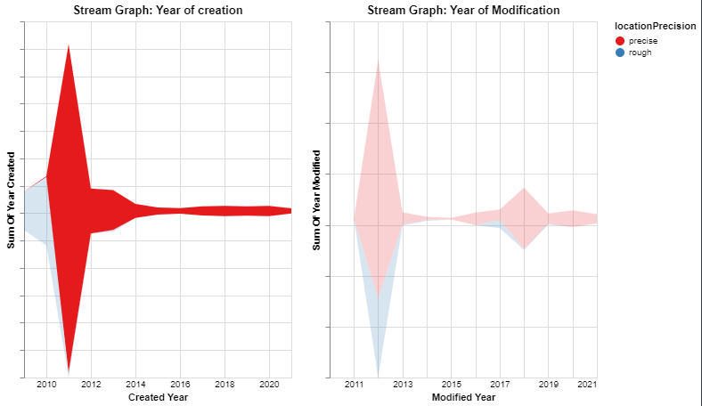
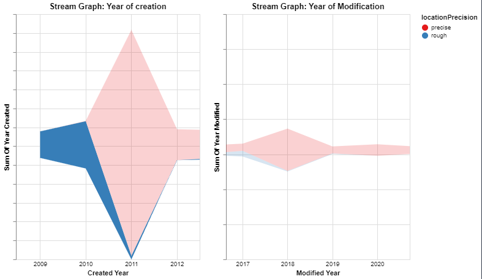

## Data Visualization Technique: Stream Graph
A streamgraph, or stream graph, is a type of stacked area graph which is displaced around a central axis, resulting in a flowing, organic shape. Unlike a traditional stacked area graph in which the layers are stacked on top of an axis, in a streamgraph the layers are positioned to minimize their "wiggle". 

{(aim|}
The aim of this visualization is to show the `creation and modification` trends of the archeological activities.This data is represented in the form of `Stream Graphs`.
The Zooming functionality provides a way to clearly find the count of creations and modifications that have been done to the locations in a given year.
`Mouseover-Hovering functionality` is provided to find whether the concentration depicted is `precise` or `rough`.
From the initial visualization of the Graph, we can see that `Year:2011` was the year where most number of location entries were created and `Year:2012` was the year in which most number of location entries were modified.
{|aim)}
**Selection on mouseover:**
```python
selection = alt.selection_single(on='mouseover')
```
**Stream Graph for year of creation:**
```python
steam_creation = alt.Chart(df_locations_mod_temp).mark_area().encode(
    alt.X('created_year:T', axis=alt.Axis(domain=False, format='%Y', tickSize=0),title='Created Year'),
    alt.Y('sum(created_year):Q', stack='center',title='Sum Of Year Created',axis=alt.Axis(labels=False)),
    alt.Color('locationPrecision:N', scale=alt.Scale(scheme='set1')),
    opacity=alt.condition(selection, alt.value(1), alt.value(0.2)),
).add_selection(
    selection
).properties(
    width=300,
    height=400
).properties(
    title='Stream Graph: Year of creation'
).interactive()
```
**Stream Graph for year of modification:**
```python
steam_modification = alt.Chart(df_locations_mod_temp).mark_area().encode(
    alt.X('modified_year:T', axis=alt.Axis(domain=False, format='%Y', tickSize=0),title='Modified Year'),
    alt.Y('sum(modified_year):Q', stack='center',title='Sum Of Year Modified',axis=alt.Axis(labels=False)),
    alt.Color('locationPrecision:N', scale=alt.Scale(scheme='set1')),
    opacity=alt.condition(selection, alt.value(1), alt.value(0.2))
).add_selection(
    selection
).properties(
    width=300,
    height=400
).properties(
    title='Stream Graph: Year of Modification'
).interactive()
```
**Display:**
```python
steam_creation | steam_modification
```
**Data Visualization Output:**


**Interaction:**
**Example 1:**
Stream Graph with Mouse-Over on Rough plots for Modified Location entries.

**Example 2:**
Stream Graph with Mouse-Over on Precise plots for Created Location entries.

**Example 3:**
Stream Graph with Mouse-Over on Rough plots for Created Location entries and Zoom in Functionality.

{(vistype|}
Stream Graph
{|vistype)}

{(vismapping|}
**Stream graph: Created Year**
x : Created year
y : Sum of entires for created year
color : locationPrecision
Color Scheme : set1
width and height: 300,400
**Stream graph: Modified Year**
x : modified year
y : sum of entries modified year
Color Scheme : set1
width and height: 300,400
{|vismapping)}

{(dataprep|}
1.Remove rows with null values for created, modified and locationPrecision.
**df_locations = locations.dropna(subset=['created','modified','locationPrecision'])**
2.Extract year from Created and Modified columns
**df_locations['created_year']=df_locations['created'].astype(str).str[:4]**
**df_locations['modified_year']=df_locations['modified'].astype(str).str[:4]**
3.Remove enries with `unlocated` entry for locationPrecision
**df_locations.drop(df_locations[df_locations['locationPrecision'] == 'unlocated' ].index,inplace=True)**
{|dataprep)}

{(limitations|}
A slider interaction instead of zooming functionality would help in easier interaction with the visualization
{|limitations)}
