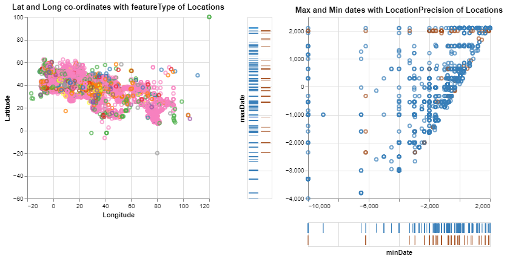
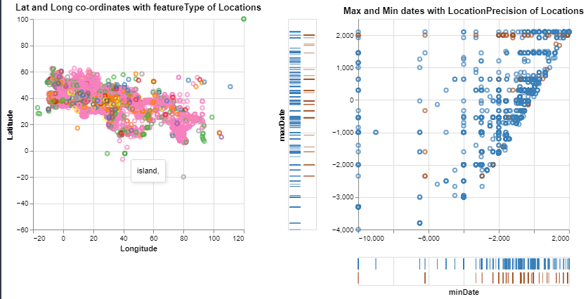
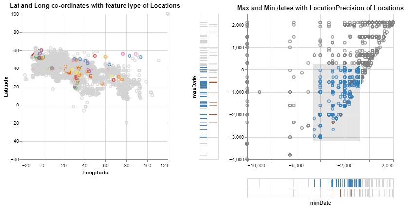

##Data Visualization Technique: Dot-Dash Plot with Scatter Plot
A Dot-dash plot provides an interactive way to visualize and analyse the data provided based on selection.
{(aim|}
The aim of this visualization is to provide the distribution of latitude and longitude of the locations, precise and rough estimate features,feature types,the dates of existence(minDate and maxDate) of the locations - when a set of settlements are selected.
The tooltip functionality of the scatterplot in the first graph provides the featureType of settlement.
The tooltip functionality of the dot Plot in the second graph provides whether the location of settlement is a precise one or the rough estimate
The min and max dash plots provide the min and max dates of the settlements.
Upon interaction : when the settlements are selected, their corresponding min dates, max dates, latitudes,longitudes and the featuretypes in the corresponding visualizations are highlighted.
{|aim)}
**Initial preparation**:
```python
alt.data_transformers.enable('json')
alt.data_transformers.disable_max_rows()
brush = alt.selection(type='interval')
tick_axis = alt.Axis(labels=False, domain=False, ticks=False)
tick_axis_notitle = alt.Axis(labels=False, domain=False, ticks=False, title='')
```
**Scatter Plot Displaying : Latitude, Longitude and feature type**
```python
scatter = alt.Chart(locations).mark_point().encode(
    alt.X('reprLong:Q',
        scale=alt.Scale(
            domain=(-20, 120),
            clamp=True
        ),
          title='Longitude'
    ),
```
```python
   alt.Y('reprLat:Q',
        scale=alt.Scale(
            domain=(-50, 100),
            clamp=True
        ),
          title='Latitude'
    ),
```
```python 
    color=alt.condition(brush, 'featureType:N', alt.value('lightgray'),legend=None),
    tooltip='featureType:N',
).add_selection(
    brush
).properties(
    width=300,
    height=300
).properties(
    title='Lat and Long co-ordinates with featureType of Locations'
)
```
**Points Plot to display the settlements based on existance**
```python
points = alt.Chart(locations).mark_point().encode(
    x=alt.X('minDate', 
            scale=alt.Scale(
            domain=(-10000, 2000),
            clamp=True
        ),
        axis=alt.Axis(title='')),
    y=alt.Y('maxDate', 
            scale=alt.Scale(
            domain=(-4000, 2500),
            clamp=True),
            axis=alt.Axis(title='')),
    color=alt.condition(brush, 'locationPrecision', alt.value('grey'),legend=alt.Legend(orient="right"),scale=alt.Scale(scheme='set1')),
    tooltip='locationPrecision'
).properties(
    selection=brush
).properties(
    width=300,
    height=300
).properties(
    title='Max and Min dates with LocationPrecision of Locations'
)
```
**Dash Plot for min and max dates on X and Y axis**
```python
x_ticks = alt.Chart(locations).mark_tick().encode(
    alt.X('minDate', 
            scale=alt.Scale(
            domain=(-10000, 2000),
            clamp=True
        ),
          axis=tick_axis
         ),
    alt.Y('locationPrecision', axis=tick_axis_notitle),
    color=alt.condition(brush, 'locationPrecision', alt.value('lightgrey'))
).properties(
    selection=brush
).properties(
    width=300,
    height=40
)
```
```python
y_ticks = alt.Chart(locations).mark_tick().encode(
    alt.X('locationPrecision', axis=tick_axis_notitle),
    alt.Y('maxDate', 
          scale=alt.Scale(
            domain=(-4000, 2500),
            clamp=True),
          axis=tick_axis),
    color=alt.condition(brush, 'locationPrecision', alt.value('lightgrey'))
).properties(
    selection=brush
).properties(
    width=40,
    height=300
)
```
**Display:**
```python
scatter | (y_ticks | (points & x_ticks))
```
**Data Visualization Output**

**Interaction:**
**Example 1:**
Tooltip functionality of scatterplot displaying featuretype

**Example 2:**
Tooltip functionality of dot plot displaying LocationPrecision

**Example 3:**
Selection of settlement type in dot plot provides information about its existance period (minDate and maxDate) and its corresponding latitude and longitude in scatterplot.

{(vistype|}
Dot-Dash Plot with corresponding Scatter Plot
{|vistype)}
{(vismapping|}
**Scatter Plot:**
x: Longitude
y: Latitude
color: Featuretype
tooltip: Featuretype
**Dot Plot:**
x: minDate
y: maxDate
color: locationPrecision
tooltip: locationPrecision
selection: intervals
**x-ticks:**
x: minDate
y: locationPrecision
color: locationPrecision
selection: interval selection
**y-ticks:**
x: locationPrecision
y: maxDate
color: locationPrecision
selection:interval selection
{|vismapping)}

{(dataprep|}
1.Removing rows having null values for minDate, maxDate and locationPrecision
**locations.dropna(axis=0,subset=['maxDate', 'maxDate', 'locationPrecision'],inplace = True)**
2.Removing `unlocated` value from `locationPrecision` column
**locations.drop(locations[locations['locationPrecision'] == 'unlocated' ].index,inplace=True)**
{|dataprep)}

{(limitations|}
The Dotdash plot is designed only for date of existance and latitude and longitude features of the settlement. This can be further extended to display information related to the creaters and the creation and modification years using histogram interaction.
{|limitations)}
