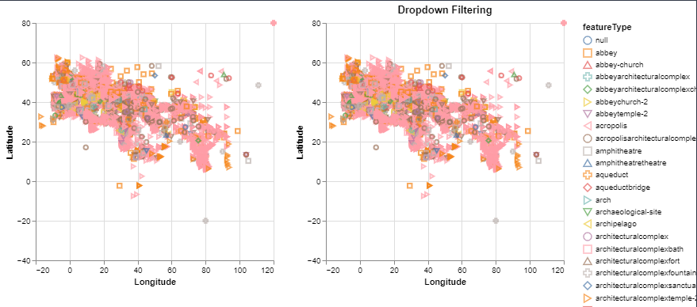
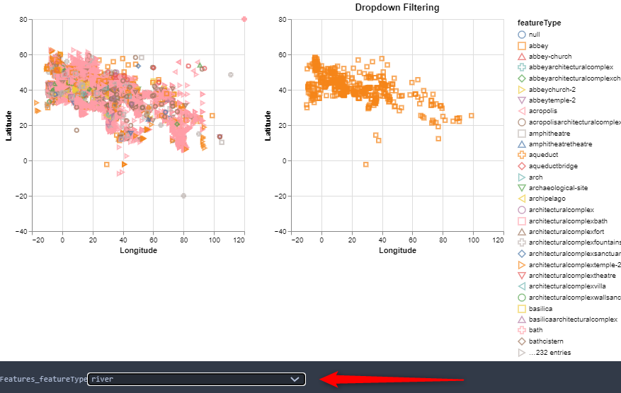

## Multiple Interactions: 
This technique shows how multiple user inputs can be layered onto a chart.The interaction with this visualization is based on dropdown values
{(aim|}
The aim of this visualization is to plot the settlements along side the latitude and longitude co-ordiantes based on the selection of featuretype by the user.
The first scatterplot provides the information about the settlements plotted based on latitude and longtide.
The tooltip functionality provides the information about (latitude,longitude) co-ordinates.
The dropdown functionality is provided to select the settlement type - and corresponding settlemets are displayed in the scatterplot on the right
{|aim)}
**Altair code to display the plot:**
```python
alt.data_transformers.disable_max_rows()
scatter = alt.Chart(locations).mark_point().encode(
    alt.X('reprLong:Q',
        scale=alt.Scale(
            domain=(-20, 120),
            clamp=True
        ),
          title='Longitude'
    ),
   alt.Y('reprLat:Q',
        scale=alt.Scale(
            domain=(-40, 80),
            clamp=True
        ),
          title='Latitude'
    ),
    shape='featureType:N',
    color=alt.Color('featureType:N'),
    tooltip='reprLatLong:N',
).properties(
    width=300,
    height=300
)
```
**Data Visualization Output:**

**Interactions:**
**Example 1:**
Tooltip functionality to display latitude and longitude co-ordinates

**Example 2:**
Dropdown selection `RIVER` results in corresponding river settlements displayed in second plot

{(vistype|}
Scatter plot with dropdown functionality
{|vistype)}
{(vismapping|}
**Scatter Plot:**
x: Longitude
y: Latitude
color: Featuretype
tooltip: (Latitude,Longitude)
interaction: dropdown
{|vismapping)}
{(dataprep|}
1.Replacing `,` in featureType with space as a part of data cleansing
**ocations['featureType'] = locations['featureType'].str.replace(",","")**
{|dataprep)}
{(limitations|}
The plot is limited only to dropdowns, other interactions such as sliders,radiobuttons and checkboxes can be added to provide various functionalities
{|limitations)}
